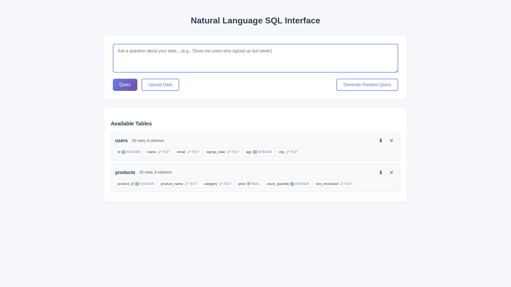
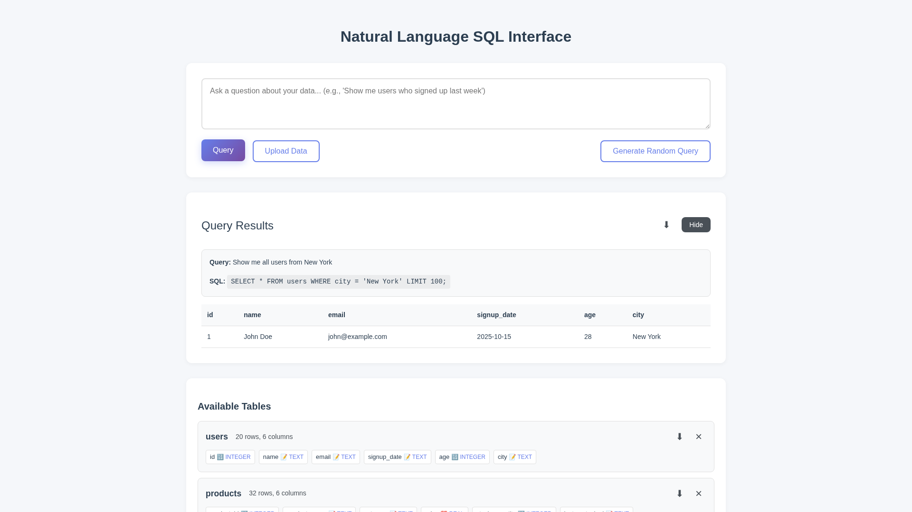

# CSV Export for Tables and Query Results

**ADW ID:** e856c968
**Date:** 2025-10-03
**Specification:** specs/issue-1-adw-e856c968-sdlc_planner-one-click-exports.md

## Overview

One-click CSV export functionality for database tables and query results, enabling users to download data directly from the UI with properly formatted CSV files using download icons positioned next to existing table and results controls.

## Screenshots





## What Was Built

- Backend CSV export endpoints with security validation
- Table export endpoint for full table downloads
- Query results export endpoint for current query downloads
- Frontend download buttons with icon-based UI
- Client-side blob handling and automatic file downloads
- CSV generation with proper escaping and header formatting

## Technical Implementation

### Files Modified

- `app/server/server.py`: Added two new export endpoints (`/api/export/table/{table_name}` GET and `/api/export/query` POST) with CSV generation, security validation, and proper response headers
- `app/client/src/api/client.ts`: Added `exportTable()` and `exportQueryResults()` methods with blob download logic and filename generation
- `app/client/src/main.ts`: Added download buttons to table headers and query results section with click handlers and error handling
- `app/client/src/style.css`: Added `.download-button` styling with hover effects
- `app/client/src/types.d.ts`: Added `ExportQueryRequest` interface matching backend model
- `app/server/core/data_models.py`: Added `ExportQueryRequest` Pydantic model
- `.claude/commands/e2e/test_export_functionality.md`: Created comprehensive E2E test file

### Key Changes

- CSV generation uses Python's `csv.DictWriter` with proper escaping for special characters and null value handling
- Security validation leverages existing `sql_security` module functions (`validate_identifier()` and `validate_sql_query()`) to prevent SQL injection
- Export endpoints return `Response` objects with `text/csv` media type and `Content-Disposition` headers for immediate downloads
- Frontend creates temporary blob URLs and programmatically triggers downloads with descriptive filenames
- Query export preserves exact column order from the original query results

## How to Use

### Exporting a Table

1. Upload a CSV/JSON/JSONL file to create a table in the database
2. Locate the table in the "Available Tables" section
3. Click the download button (⬇) to the left of the remove button (×)
4. The table data downloads as `{table_name}.csv`

### Exporting Query Results

1. Run any SQL query using the natural language interface
2. View the results in the "Query Results" section
3. Click the download button (⬇) to the left of the "Hide" button
4. Results download as `query_results_{timestamp}.csv`

## Configuration

No configuration required. The feature uses the existing database connection and security validation modules.

## Testing

### Manual Testing
- Upload sample data and verify table export downloads correctly
- Run various queries and verify results export matches displayed data
- Test with special characters, null values, and empty results

### E2E Testing
- Execute `.claude/commands/e2e/test_export_functionality.md` test file
- Validates upload, table export, query execution, and results export workflows
- Includes screenshot capture for verification

### Validation Commands
```bash
cd app/server && uv run pytest
cd app/client && bun tsc --noEmit
cd app/client && bun run build
```

## Notes

- CSV format chosen for universal spreadsheet application compatibility
- Filenames include timestamps for query exports to prevent confusion with multiple downloads
- Download buttons use minimal icon-based design (⬇) to avoid UI clutter
- Export endpoints leverage existing security validation to prevent unauthorized access
- Future enhancements could include JSON/Excel formats, filtered exports, or streaming for large datasets
